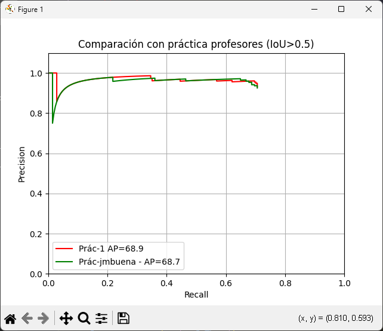
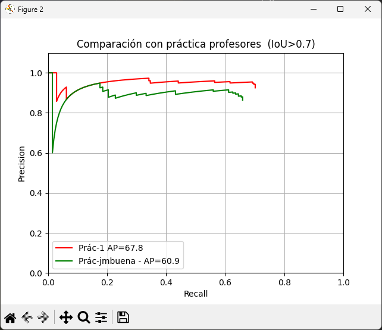

# Práctica 1 - Datos de Alumnos

Proyecto de detección y evaluación de resultados.

## Resultados

### IoU > 0.5

### IoU > 0.7

## Estructura del proyecto

- `img/` - Imágenes de resultados
- `resultado_imgs/` - Resultados de las imágenes procesadas
- `train_detection/` - Datos de entrenamiento
- `test_detection/` - Datos de test

## Archivos principales

- `main.py` - Script principal
- `evaluar_resultados.py` - Evaluación de resultados

## Pipeline de main.py

El script `main.py` implementa un pipeline de detección de paneles azules con los siguientes pasos:

1. **Preprocesamiento**: Conversión a escala de grises, desenfoque Gaussiano y ecualización del histograma por tiles (CLAHE)
2. **Detección de regiones**: Uso del detector MSER para obtener regiones candidatas
3. **Filtrado geométrico**: Eliminación de candidatos según relación de aspecto (ratio ancho/alto)
4. **Filtrado por color**: 
   - Agrandado de bounding boxes
   - Cálculo de score de azul mediante correlación con máscara ideal en espacio HSV
   - Filtrado por umbral de score (0.55)
5. **Non-Maximum Suppression (NMS)**: Eliminación de detecciones solapadas (IoU > 0.5)
6. **Salida**: Guardado de resultados en `resultado.txt` e imágenes con detecciones en `resultado_imgs/`

